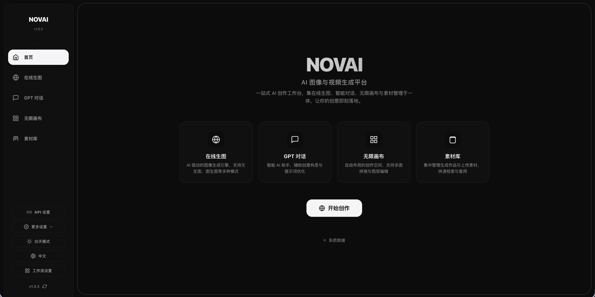
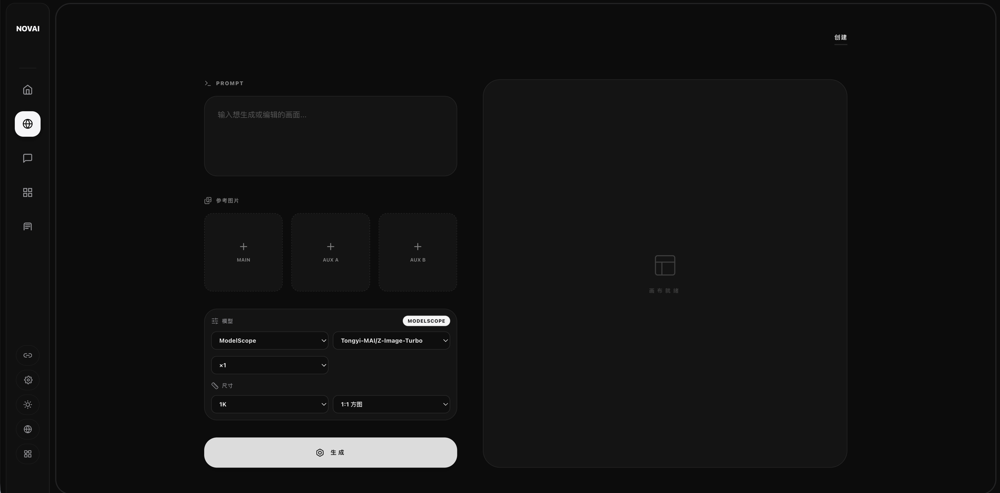
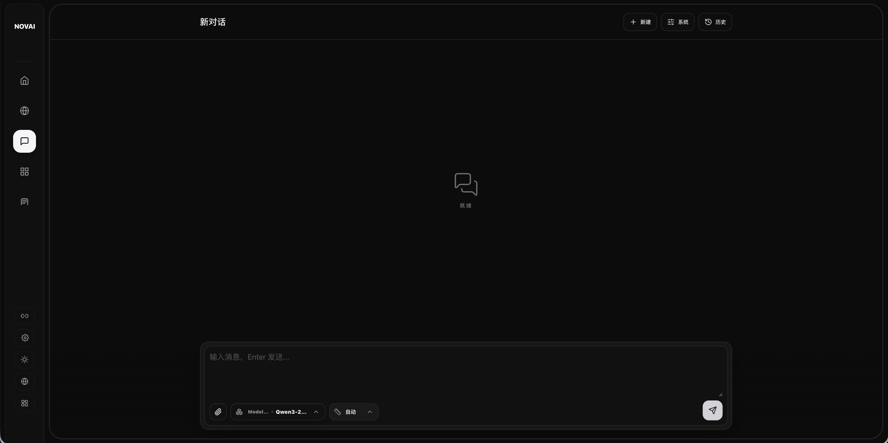
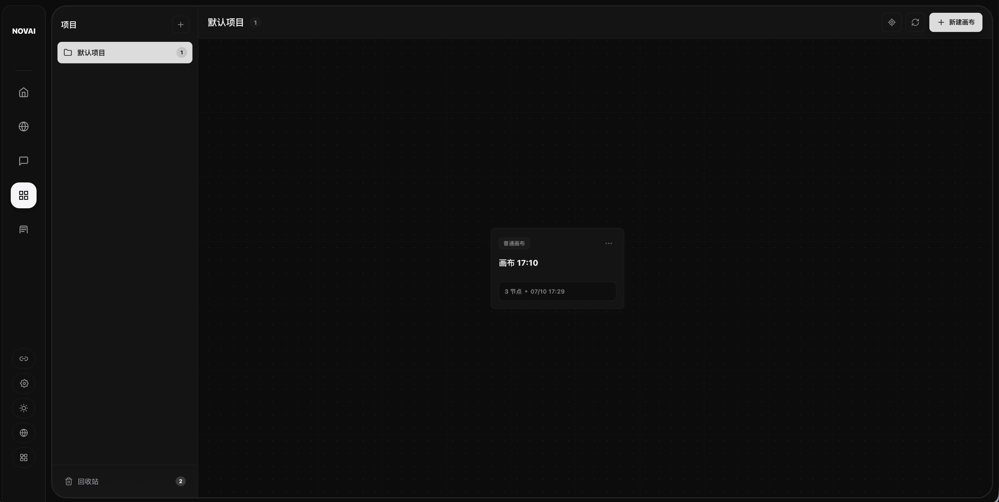
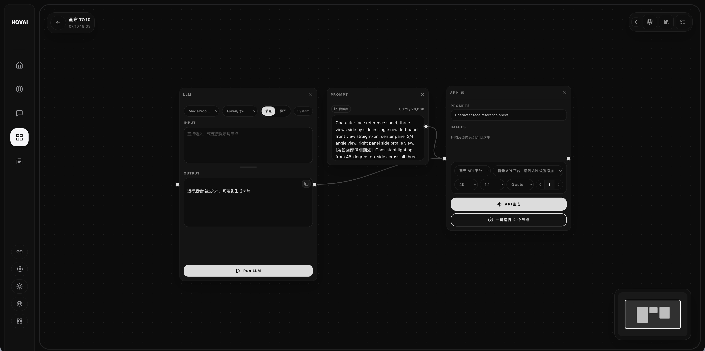

# NOVAI — 无限画布 AI 创作平台

> 自由地在无限画布上生成图像、视频，用节点串联工作流。











---

## 快速开始

### 环境要求

- Python 3.10+（[下载](https://www.python.org/downloads/)，安装时勾选 "Add Python to PATH"）
- Git（可选，用于自动更新）

### Windows

```
首次使用：双击 install.bat → 安装依赖（创建虚拟环境 + 安装包）
日常启动：双击 run.bat     → 启动服务
一键启动：双击 启动.bat     → 自动检查依赖并启动（首次也可直接用这个）
```

浏览器自动打开 `http://127.0.0.1:3000/`

### macOS

```
首次使用：双击 mac-修复权限.command → 移除安全限制（仅需一次）
日常启动：双击 启动.command         → 自动安装依赖并启动
```

> 如果 macOS 提示「无法打开」，到 系统设置 → 隐私与安全性 → 点击「仍要打开」

### 手动安装

```bash
pip install -r requirements.txt
python main.py
```

---

## AI 模型

内置 **ModelScope** 免费 API，开箱即用：

| 类型 | 模型 | 说明 |
|------|------|------|
| 对话 | Qwen3-235B | 通义千问旗舰，逻辑推理/写作 |
| 对话 | Qwen3-VL-235B | 多模态，可分析图片 |
| 生图 | Qwen-Image-2512 | 中文文字渲染最优，海报 Banner 首选 |
| 生图 | FLUX.2-klein-9B | 画面质感最好 |
| 生图 | Z-Image-Turbo | 1-2 秒快速出图 |
| 生图 | Qwen-Image-Edit-2511 | 说话就能改图 |
| 视频 | agnes-video-v2.0 | 免费视频生成 |

---

## 特色功能

- 🎨 **无限画布** — 自由缩放、拖拽、连线创作
- ⚡ **节点工作流** — 图像/视频/LLM 节点串联
- 🔌 **插件系统** — Photoshop 面板、Chrome 扩展
- 🌐 **多仓库更新** — GitHub / Gitee / ModelScope 三源
- 🇨🇳 **中文优化** — Qwen 生态深度集成

---

## 更新

项目会检查 GitHub、Gitee、ModelScope 三个源的最新版本，自动推送更新通知。

### v1.0.82

- **设置弹窗重构**：左右分栏布局，API 设置与工作流设置提升为侧边栏一级标签
- **自定义弹窗大小**：支持拖拽调整设置弹窗尺寸，自动记忆
- **侧边栏优化**：折叠状态宽度收窄至 56px，版本号支持三仓库更新检测高亮
- **内嵌页面统一**：API/工作流设置风格与通用/外观/关于面板完全一致
- 修复设置弹窗 iframe 模糊及偶发白屏问题

### v1.0.81

- **桌面版 UI 重构**：采用 frameless 无边框窗口，去除顶部黑条与 logo，界面更沉浸
- **自定义标题栏按钮**：右上角悬浮关闭/最小化/最大化按钮，支持窗口拖拽缩放
- **Mac 同步适配**：Electron 端同步 frameless 窗口，Mac 使用原生红绿灯按钮
- 辅助线系统优化、斜杠菜单交互改进
- 安装程序打包、一键部署支持
